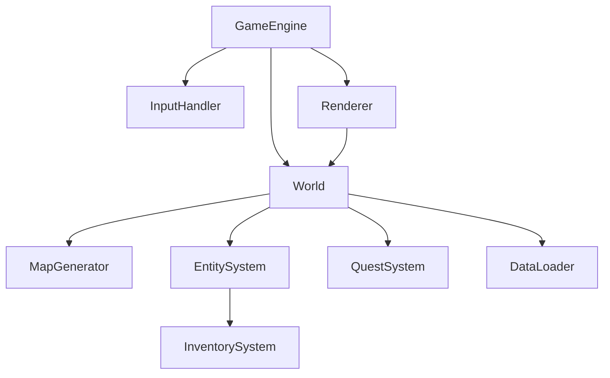
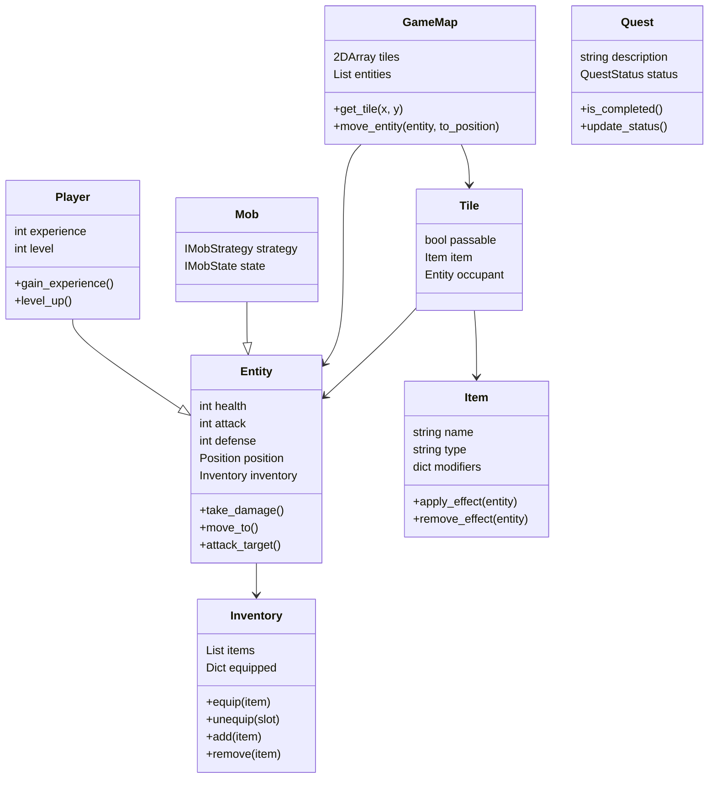
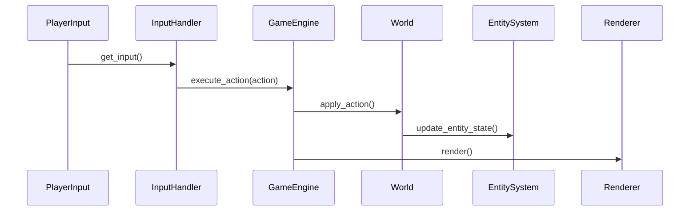
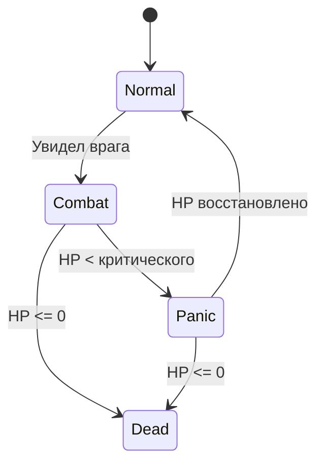

## Архитектурное описание программной системы Roguelike

### 1. Введение

**1.1. Назначение**
Настоящий документ описывает архитектуру программной системы Roguelike — консольной игры в жанре roguelike. Документ предназначен для разработчиков, архитекторов и участников проектной команды и служит основой для реализации, поддержки и последующего расширения системы.

**1.2. Область применения**
Система представляет собой пошаговую игру с перемещением персонажа по тайловой карте, взаимодействием с окружением, выполнением квестов и сражениями с противниками. Игра обладает высокой степенью повторяемости, реализует консольный интерфейс и содержит элементы генерации игровых объектов и квестов.

**1.3. Объём реализации**
Настоящий документ описывает архитектуру базовой версии системы, включающей поддержку пользовательского ввода, генерации и отображения карты, боевой и инвентарной систем, генерации заданий и управления игровыми сущностями.

---

### 2. Архитектурные требования (Architectural Drivers)

**2.1. Функциональные требования**

* Перемещение персонажа игрока по карте с клавиатуры.
* Генерация карты случайным образом или загрузка из внешнего файла.
* Учет характеристик игровых сущностей: здоровье, атака, защита и пр.
* Инвентарь, поддерживающий хранение и экипировку предметов.
* Влияние экипированных предметов на характеристики персонажа.
* Отображение игрового состояния в консольном режиме.
* Наличие основной сюжетной линии и автогенерация побочных заданий.
* Реализация противников с различным поведением (агрессивное, пассивное, избегающее).

**2.2. Нефункциональные требования**

* Расширяемость: система должна поддерживать добавление новых сущностей, предметов, механик и квестов без изменения существующего кода.
* Поддержка платформенной независимости: работа на Windows/Linux/macOS без зависимости от специфичных библиотек.
* Устойчивость: устойчивое поведение при непредвиденном пользовательском вводе.
* Тестируемость: наличие модульной структуры, пригодной для автоматизированного тестирования компонентов.

---

### 3. Роли и сценарии использования

**3.1. Участники**

* **Игрок** — конечный пользователь, осуществляющий управление персонажем.
* **Система** — исполняемая программа, обрабатывающая ввод, обновляющая состояние игрового мира и отображающая его.

**3.2. Сценарии использования**

| ID    | Наименование          | Описание                                                          |
| ----- | --------------------- | ----------------------------------------------------------------- |
| UC-01 | Управление персонажем | Игрок осуществляет перемещение, атаку, взаимодействие с объектами |
| UC-02 | Получение предметов   | Персонаж поднимает предметы с карты                               |
| UC-03 | Управление инвентарем | Игрок надевает/снимает экипировку, использует предметы            |
| UC-04 | Ведение боя           | Персонаж вступает в бой с мобами                                  |
| UC-05 | Завершение квеста     | Игрок завершает побочное или основное задание                     |
| UC-06 | Инициализация уровня  | Система загружает карту из файла или генерирует её                |

---

### 4. Профиль целевого пользователя

Целевой пользователь — человек, обладающий базовым или средним игровым опытом, знакомый с играми с текстовым или псевдографическим интерфейсом. Ожидаемое поведение пользователя включает исследование мира, выполнение заданий, принятие стратегических решений в условиях ограниченной информации и ресурсов. Предполагается высокий интерес к повторному прохождению и экспериментам.

### 5. Архитектурная композиция (Component View)

**5.1. Общая структура**
Система построена по принципам модульности и разделения ответственности. Основные подсистемы организованы по функциональному признаку и взаимодействуют через чётко определённые интерфейсы.

**5.2. Компоненты системы**

| Компонент         | Назначение                                                                                                              |
| ----------------- | ----------------------------------------------------------------------------------------------------------------------- |
| `GameEngine`      | Главный управляющий компонент. Запускает игровой цикл, управляет состояниями игры, координирует взаимодействие модулей. |
| `InputHandler`    | Получает и обрабатывает ввод от пользователя (клавиши).                                                                 |
| `Renderer`        | Отвечает за визуализацию состояния карты и интерфейса в консоль.                                                        |
| `World`           | Представляет текущее состояние игрового мира (карта, сущности, предметы).                                               |
| `EntitySystem`    | Управляет игровыми сущностями: персонажем игрока, мобами, NPC.                                                          |
| `InventorySystem` | Управляет инвентарем и экипировкой сущностей.                                                                           |
| `QuestSystem`     | Хранит и обновляет состояние текущих квестов.                                                                           |
| `MapGenerator`    | Отвечает за генерацию карты и размещение объектов.                                                                      |
| `DataLoader`      | Загружает данные (карты, предметы, мобов, квесты) из внешних файлов.                                                    |

**5.3. Взаимодействие компонентов**

* `GameEngine` вызывает `InputHandler` и `Renderer` в рамках основного цикла.
* `InputHandler` интерпретирует команды игрока и преобразует их в действия.
* `World` и `EntitySystem` обновляются в зависимости от команд и логики квестов.
* `Renderer` отображает текущее состояние `World`.

---

### 6. Логическая структура (Logical View / Class Diagram)

**6.1. Основные классы и связи**

* `Entity`

  * **Атрибуты**: `health`, `attack`, `defense`, `position`, `inventory`
  * **Методы**: `take_damage()`, `move_to()`, `attack_target()`

* `Player : Entity`

  * **Дополнительно**: `experience`, `level`, `gain_experience()`, `level_up()`

* `Mob : Entity`

  * **Дополнительно**: `strategy: IMobStrategy`, `state: IMobState`

* `Item`

  * **Атрибуты**: `name`, `type`, `modifiers: Dict[str, int]`
  * **Методы**: `apply_effect(entity)`, `remove_effect(entity)`

* `Inventory`

  * **Атрибуты**: `items: List[Item]`, `equipped: Dict[str, Item]`
  * **Методы**: `equip(item)`, `unequip(slot)`, `add(item)`, `remove(item)`

* `Tile`

  * **Атрибуты**: `passable: bool`, `item: Optional[Item]`, `occupant: Optional[Entity]`

* `GameMap`

  * **Атрибуты**: `tiles: 2D[Tile]`, `entities: List[Entity]`
  * **Методы**: `get_tile(x, y)`, `move_entity(entity, to_position)`

* `Quest`

  * **Атрибуты**: `description`, `status: QuestStatus`
  * **Методы**: `is_completed()`, `update_status()`

**6.2. Диаграмма классов**

---

### 7. Поведение и взаимодействие (Behavioral View)

**7.1. Диаграмма последовательности: "Ход игрока"**

**7.2. Диаграмма состояний: "Жизненный цикл сущности"**

---

### 8. Описание данных

| Объект      | Структура                                                        |
| ----------- | ---------------------------------------------------------------- |
| `MapData`   | JSON/текстовый файл. Хранит тайлы: тип, координаты, проходимость |
| `ItemData`  | JSON. Хранит предметы: `id`, `name`, `type`, `modifiers`         |
| `MobData`   | JSON. Шаблоны мобов: `type`, `strategy`, `stats`, `ai_state`     |
| `QuestData` | JSON. Описание квестов: `goal`, `trigger`, `reward`, `status`    |

---

### 9. Применяемые шаблоны проектирования (Design Patterns)

| Паттерн                               | Назначение                                                          |
| ------------------------------------- | ------------------------------------------------------------------- |
| **Стратегия** (`IMobStrategy`)        | Выбор поведения моба: агрессия, бегство, патруль                    |
| **Состояние** (`IMobState`)           | Поведение в зависимости от здоровья или других условий              |
| **Команда** (`ICommand`)              | Все пользовательские действия реализованы через командный интерфейс |
| **Декоратор** (`ItemEffectDecorator`) | Экипировка изменяет характеристики сущности                         |
| **Строитель** (`MapBuilder`)          | Генерация карты с параметризацией по типу, размеру и шаблонам       |
| **Фабрика** (`EntityFactory`)         | Создание мобов и предметов по конфигурации                          |
| **Прототип**                          | Клонирование мобов, размножающихся на карте                         |

---

### 10. План приёмки (Acceptance Plan)

| Требование                                                | Метод проверки              |
| --------------------------------------------------------- | --------------------------- |
| Персонаж управляется с клавиатуры                         | Интерактивный тест          |
| Карта загружается или генерируется                        | Модульный тест генерации    |
| Инвентарь и экипировка влияют на характеристики           | Юнит-тест инвентаря         |
| Реализована боевая система                                | Интеграционный тест боя     |
| Противники ведут себя по-разному                          | Тест с симуляцией стратегий |
| Квесты создаются и завершаются                            | Интеграционный тест квестов |
| Архитектура поддерживает расширение                       | Код-ревью + модульный тест  |
| Соответствие архитектуре, наличие документации и диаграмм | Ревизия и соответствие ГОСТ |

